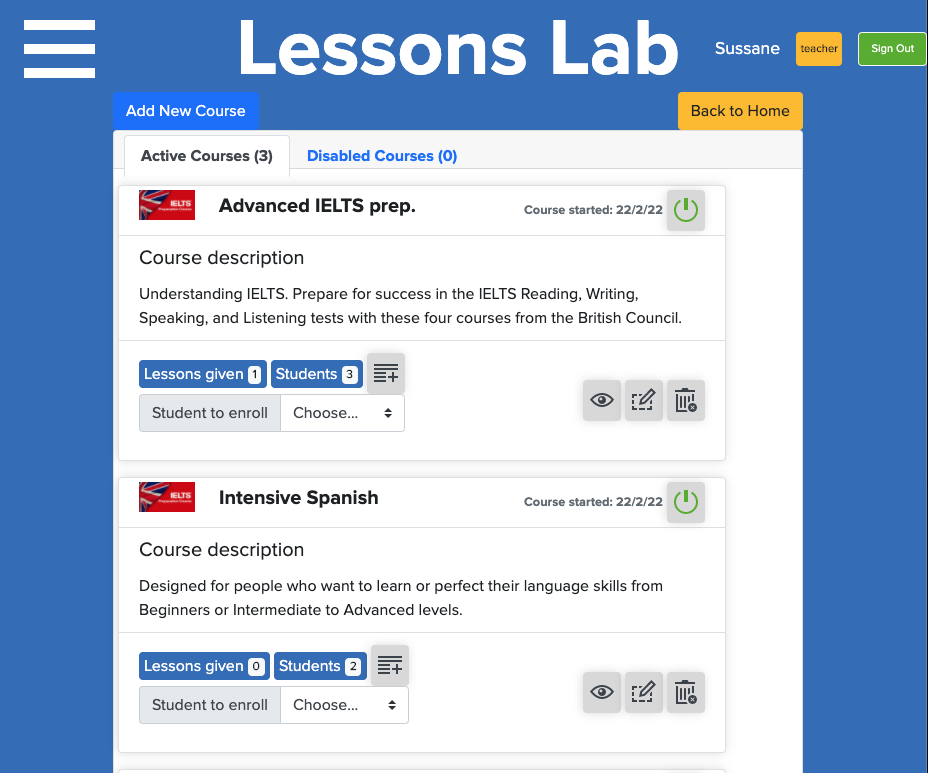

# Lessons Lab

This web application is a mobile application targeting freelance teachers to admin, track, and manage lessons with their students.

. The front end is based on the original design idea by [Gregoire Vella on Behance ](https://www.behance.net/gallery/19759151/Snapscan-iOs-design-and-branding?tracking_source=).




## Live App link

[heroku live site](https://shrouded-plains-92148.herokuapp.com/)

For the demo, use the following pre-loaded users. You could also create new users. For all users password is: password

| email            | name    | role    |   |   |
|------------------|---------|---------|---|---|
| email1@email.com | Sussane | teacher |   |   |
| email2@email.com | Carlos  | teacher |   |   |
| email3@email.com | Anna    | student |   |   |
| email4@email.com | Clara   | student |   |   |
| email5@email.com | Cecil   | student |   |   |
| email6@email.com | Caro    | student |   |   |
| email7@email.com | Matt    | student |   |   |
| email8@email.com | Laureano| student |   |   |
| email9@email.com | Robert  | student |   |   |

## Customer Story

    - The user logs in to the app, only by typing the email
        . Additional feature implemented: password is an additional feature (demo password: password)
        
    3. The logged-in user is presented with a profile page that includes:
        a. Bookings ("all my transactions")
            - Inside bookings two taps hell to show  
        b. All Course 
        d. Additional feature: All students '''not abailable in demo'''

    4. When a logged-in user opens "My billable bookings" page
        a. Total amount of booked minutes are displayed on top
            i. Additional feature: All equivalent revenue also displayed
        b. A list of all transactions created by a logged-in user is displayed (sorted by most recent)
        c. Each transaction displays:
            i.  Student name (name), 
            ii. minutes-amount and date, 
            iii. equivalent price per session 
            iv. icon of the Course (group) it belongs to.
        d. An action button "Add new booking" is displayed
    
    5. When logged-in user opens "My non-billable booking" page
        a. A list of all transactions that are created by a logged-in user but not assigned to any course (group), or student (user) sorted by the most recent transaction (diagnostics session - needs analysis - nonbillable)
        b. The design of the page is similar to the "My billable bookings"

    6. When a logged-in user opens the "All Courses " page:
        a. A list of all courses is displayed in alphabetical order.
            
        b. Each Course displays its icon, name and record creation date.

    
    7. When logged-in user opens the "Course transactions" page:
        a. A list of all transactions that belong to that Course are displayed.
        b. The design of the page is similar to the "All my bookings". Besides the information that appears in All my Bookings page, each booking displays the name of the author of the transaction.

    8. When a logged-in user opens "create a new course" or "Add new transaction" page
        a. A form with all necessary fields is displayed.

        
    9. Add feature: For create a new course, the following key data should be provided (among others)
            i. Course name
            ii. Price per session
            iii. Session length
            
    10. Additional feature: Signing up students to courses:
        a. Only a professor and course author can enroll students in courses.
        b. Enroll student button is available only on the "course index page"
        c. "add a new transaction" shows on the "course transaction page"
            i. A transaction can be created only for students signed up into the Course.
            
    11. Additional features:Signup of students page
        a. Students will be created only by teachers. Fields will include.
            i. Name
            ii. Email
            iii. Role: student
        ```for simplification this feature is not implemented in the demo```

## Environment set up requirements

To run this project, you need ruby installed in your environment
Run the following command:

```
$ ruby -v
```

You should have a result similar to this:
s
```
ruby 2.6.5p114 (2019-10-01 revision 67812) [x86_64-linux]
```

If you don't get that result, follow this [link](https://www.ruby-lang.org/en/documentation/installation/) and install Ruby in your local environment.

### Setup
- Clone this repository in your local environment
- Located on the root of repository execute 

```bundle install``` 
 
This action will install all the required dependencies. 

## Built With

- Ruby
- Ruby on Rails
- bootstrap
- Devise
- RSpec
- Capybara
- FactoryBot
- Shoulda-Matchers


## Authors

👤 Carlos Anriquez

- Github: [@canriquez](https://github.com/canriquez)
- Twitter: [@cranriquez](https://twitter.com/cranriquez)
- Linkedin: [linkedin](https://www.linkedin.com/in/carlosanriquez/)

## 🤝 Contributing

Contributions, issues and feature requests are welcome!

Feel free to check the [issues page](issues/).

## Acknowledgments

- My Family (Oh man, after 70 hs in 9 days, definetley it has been a fundamental support)
- The great TSE team for a fast review, key challenges and contributions: Addo, Simon and Issac. Thanks Guys!
- @microverse / The Corgis


## Show your support

Give a ⭐️ if you like this project!